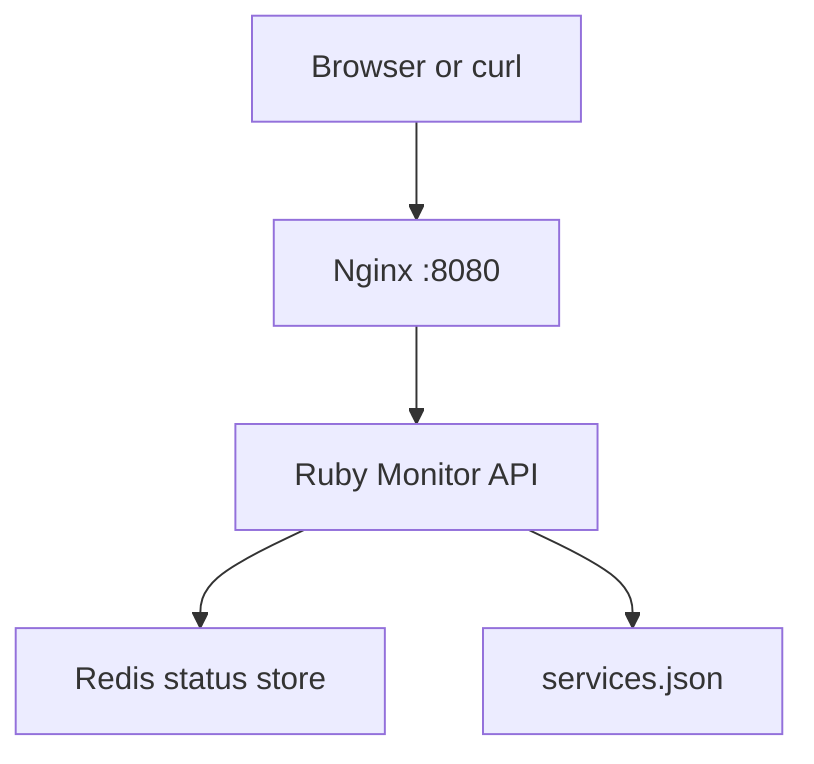

# Container Stack Monitor

Container Stack Monitor is a Docker-focused portfolio project. It runs a Ruby monitoring API behind Nginx and stores service status checks in Redis.

## Features

- Multi-container Docker Compose stack.
- Ruby API service with health, service, check, and metrics endpoints.
- Redis persistence for service status checks.
- Nginx reverse proxy on port 8080.
- Docker health checks for app and Redis.
- Prometheus-style metrics endpoint.

## Tech Stack

- Docker and Docker Compose
- Ruby 3.3
- Sinatra
- Redis
- Nginx
- RSpec

## Architecture



## Run With Docker

```bash
docker compose up --build
```

Open health endpoint through Nginx:

```bash
curl http://localhost:8080/health
```

List services:

```bash
curl http://localhost:8080/services
```

Record a check:

```bash
curl -X POST http://localhost:8080/checks \
  -H "Content-Type: application/json" \
  -d '{"service":"payments-api","status":"healthy","message":"Responded in 80 ms"}'
```

View metrics:

```bash
curl http://localhost:8080/metrics
```

## Docker Commands To Know

```bash
docker compose ps
docker compose logs -f monitor
docker compose exec redis redis-cli ping
docker compose down
```

## Run Tests

```bash
docker compose run --rm monitor bundle exec rspec
```

## Why This Project Helps Selection

This project proves that you can work with Docker beyond a simple Dockerfile. It includes multiple services, internal networking, health checks, reverse proxy configuration, persistent volumes, environment variables, and operational endpoints.

